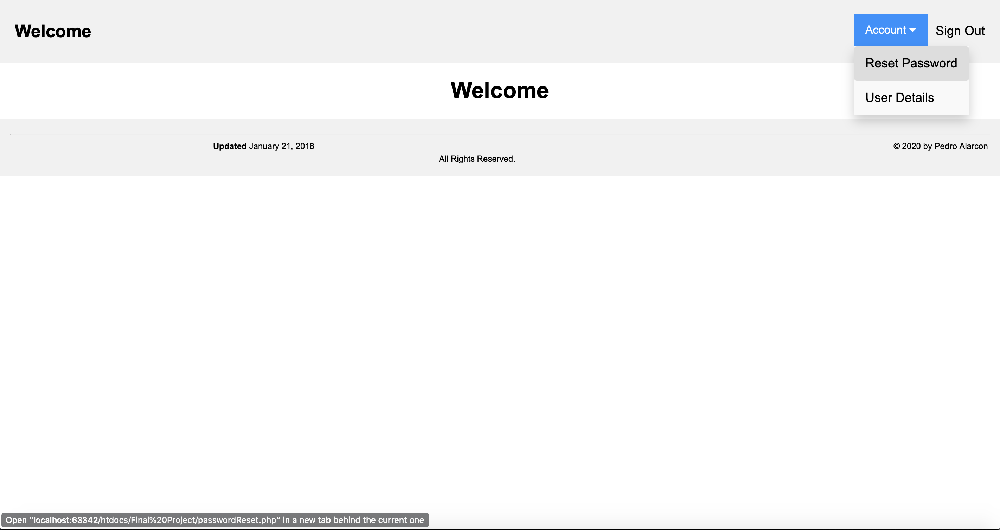
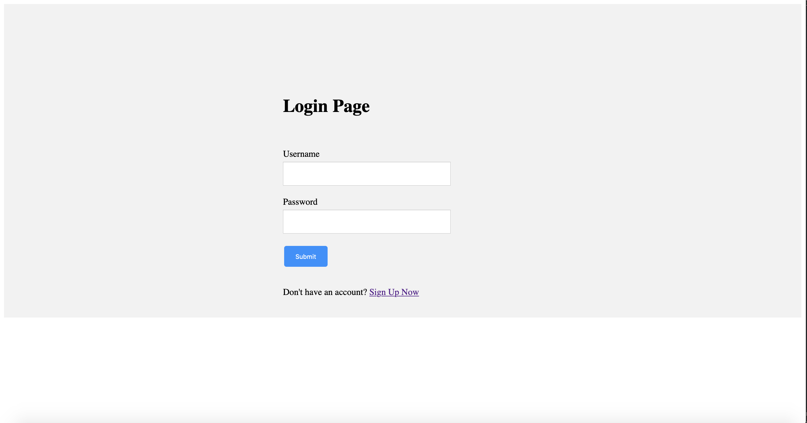
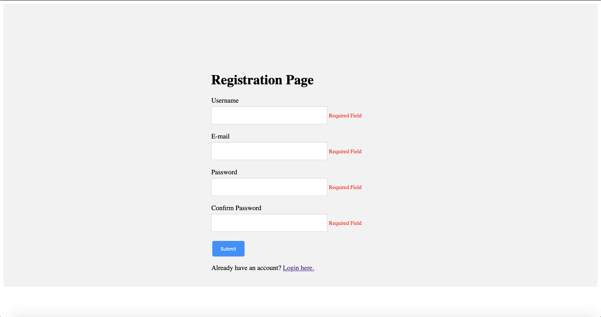
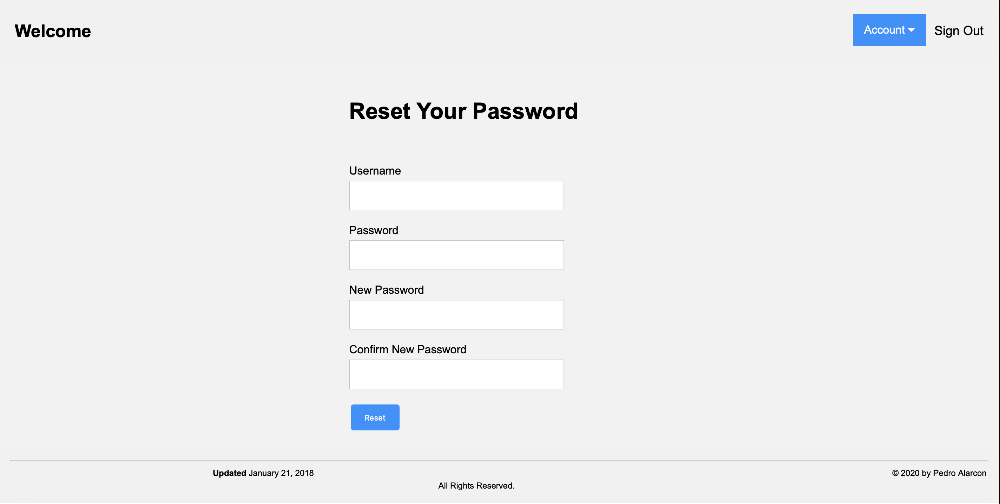

# Secured-Login-System
Uses PHP embedded with MySQL for user registration and authentication. Styles built with HTML and CSS.

1. [Login](login.php) - Authenticates User Credentails Against Database
2. [Registration](register.php) - Verifies Unique Credentials and Stores Data
3. [Welcome](homepage.php) - Main Homepage
4. [Account Details](account.php) - Details for Logged In User
5. [Password Reset](passwordReset.php) - Updates Password Column in users Database
6. [Log out](logout.php) - Destroys Current Session

### Welcome

Once user is authenticated, redirect to welcome page.

### Login

Login page authenticates user-input credentails against 'users' database. Redirects to welcome page is match found. 
  

### Registration

Saves user credentials in 'users' table. 

### Password Reset

Resets password.

